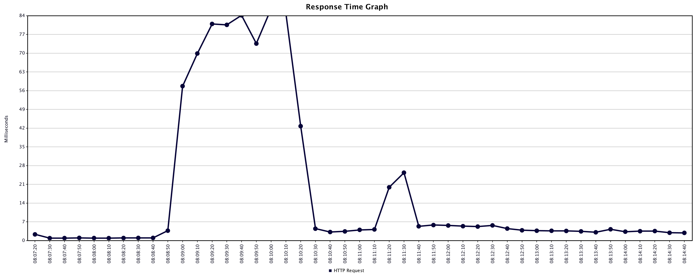

# experiments

## Exp 1 - No back pressure

High sustained load - 50 threads, 10000 records sent per, no wait time

Lots of warnings...
```
16:16:25.209 [kpl-daemon-0003] INFO  c.a.services.kinesis.producer.LogInputStreamReader - [2021-04-30 16:16:25.177912] [0x00004aa3][0x000070000c351000] [info] [processing_statistics_logger.cc:114] Stage 2 Triggers: { stream: 's2', manual: 0, count: 0, size: 0, matches: 0, timed: 225, KinesisRecords: 469, PutRecords: 225 }
16:16:25.209 [kpl-daemon-0003] WARN  c.a.services.kinesis.producer.LogInputStreamReader - [2021-04-30 16:16:25.177942] [0x00004aa3][0x000070000c351000] [warning] [processing_statistics_logger.cc:126] PutRecords processing time is taking longer than 15000 ms to complete.  You may need to adjust your configuration to reduce the processing time.
```
Then tons of errors

```
16:16:55.297 [pool-1-thread-7] WARN  ds.streamingest.service.StreamWriter - callback error count is 49160
```

With extended logging:

```
18:59:23.297 [pool-1-thread-29] ERROR ds.streamingest.service.StreamWriter - Record failed to put, partitionKey=1, payload=[B@21123ae, attempts:
Delay after prev attempt: 29986 ms, Duration: 0 ms, Code: Expired, Message: Expiration reached while waiting in limiter
Delay after prev attempt: 23 ms, Duration: 0 ms, Code: Expired, Message: Expiration reached while waiting in limiter
Delay after prev attempt: 0 ms, Duration: 0 ms, Code: Expired, Message: Record has reached expiration
```




The trend is steady response time, then a latency spike while messages are being discarded, a temporary resumption of 
Kinesis writes, then the thrashing below.

Then...

```
java.lang.RuntimeException: Future for message id 307470 not found as potentially it was a duplicate message or was timed out in Java layer.
```

At some point the KPL process starts crapping out...

```
Exception in thread "kpl-callback-pool-1-thread-3164" java.lang.OutOfMemoryError: unable to create native thread: possibly out of memory or process/resource limits reached
```

At this time HTTP errors returned to client 

CLient receives ok response even when KPL error callbacks invokved, then respone time spikes, 
then when KPL dead lots of error responses with quick response time

Saw a crash of the app once during experiments

```
08:04:15.646 [http-nio-8080-exec-7] ERROR o.a.c.c.C.[.[localhost].[/].[dispatcherServlet] - Servlet.service() for servlet [dispatcherServlet] in context with path [] threw exception [Request processing failed; nested exception is com.amazonaws.services.kinesis.producer.DaemonException: The child process has been shutdown and can no longer accept messages.] with root cause
com.amazonaws.services.kinesis.producer.DaemonException: The child process has been shutdown and can no longer accept messages.
        at com.amazonaws.services.kinesis.producer.Daemon.add(Daemon.java:173)
        at com.amazonaws.services.kinesis.producer.KinesisProducer.addUserRecord(KinesisProducer.java:625)
        at com.amazonaws.services.kinesis.producer.KinesisProducer.addUserRecord(KinesisProducer.java:535)
        at com.amazonaws.services.kinesis.producer.KinesisProducer.addUserRecord(KinesisProducer.java:411)
        at ds.streamingest.service.StreamWriter.writeToStream(StreamWriter.java:60)
        at ds.streamingest.controller.MappedIngestController.processBodyExtraction(MappedIngestController.java:88)
        at ds.streamingest.controller.MappedIngestController.ingest(MappedIngestController.java:44)
        at jdk.internal.reflect.GeneratedMethodAccessor39.invoke(Unknown Source)
        at java.base/jdk.internal.reflect.DelegatingMethodAccessorImpl.invoke(DelegatingMethodAccessorImpl.java:43)
        at java.base/java.lang.reflect.Method.invoke(Method.java:566)
        at org.springframework.web.method.support.InvocableHandlerMethod.doInvoke(InvocableHandlerMethod.java:197)
        at org.springframework.web.method.support.InvocableHandlerMethod.invokeForRequest(InvocableHandlerMethod.java:141)
        at org.springframework.web.servlet.mvc.method.annotation.ServletInvocableHandlerMethod.invokeAndHandle(ServletInvocableHandlerMethod.java:106)
        at org.springframework.web.servlet.mvc.method.annotation.RequestMappingHandlerAdapter.invokeHandlerMethod(RequestMappingHandlerAdapter.java:894)
        at org.springframework.web.servlet.mvc.method.annotation.RequestMappingHandlerAdapter.handleInternal(RequestMappingHandlerAdapter.java:808)
        at org.springframework.web.servlet.mvc.method.AbstractHandlerMethodAdapter.handle(AbstractHandlerMethodAdapter.java:87)
        at org.springframework.web.servlet.DispatcherServlet.doDispatch(DispatcherServlet.java:1060)
        at org.springframework.web.servlet.DispatcherServlet.doService(DispatcherServlet.java:962)
        at org.springframework.web.servlet.FrameworkServlet.processRequest(FrameworkServlet.java:1006)
        at org.springframework.web.servlet.FrameworkServlet.doPost(FrameworkServlet.java:909)
        at javax.servlet.http.HttpServlet.service(HttpServlet.java:652)
        at org.springframework.web.servlet.FrameworkServlet.service(FrameworkServlet.java:883)
        at javax.servlet.http.HttpServlet.service(HttpServlet.java:733)
        at org.apache.catalina.core.ApplicationFilterChain.internalDoFilter(ApplicationFilterChain.java:227)
        at org.apache.catalina.core.ApplicationFilterChain.doFilter(ApplicationFilterChain.java:162)
        at org.apache.tomcat.websocket.server.WsFilter.doFilter(WsFilter.java:53)
        at org.apache.catalina.core.ApplicationFilterChain.internalDoFilter(ApplicationFilterChain.java:189)
        at org.apache.catalina.core.ApplicationFilterChain.doFilter(ApplicationFilterChain.java:162)
        at org.springframework.web.filter.RequestContextFilter.doFilterInternal(RequestContextFilter.java:100)
        at org.springframework.web.filter.OncePerRequestFilter.doFilter(OncePerRequestFilter.java:119)
        at org.apache.catalina.core.ApplicationFilterChain.internalDoFilter(ApplicationFilterChain.java:189)
        at org.apache.catalina.core.ApplicationFilterChain.doFilter(ApplicationFilterChain.java:162)
        at org.springframework.web.filter.FormContentFilter.doFilterInternal(FormContentFilter.java:93)
        at org.springframework.web.filter.OncePerRequestFilter.doFilter(OncePerRequestFilter.java:119)
        at org.apache.catalina.core.ApplicationFilterChain.internalDoFilter(ApplicationFilterChain.java:189)
        at org.apache.catalina.core.ApplicationFilterChain.doFilter(ApplicationFilterChain.java:162)
        at org.springframework.boot.actuate.metrics.web.servlet.WebMvcMetricsFilter.doFilterInternal(WebMvcMetricsFilter.java:93)
        at org.springframework.web.filter.OncePerRequestFilter.doFilter(OncePerRequestFilter.java:119)
        at org.apache.catalina.core.ApplicationFilterChain.internalDoFilter(ApplicationFilterChain.java:189)
        at org.apache.catalina.core.ApplicationFilterChain.doFilter(ApplicationFilterChain.java:162)
        at org.springframework.web.filter.CharacterEncodingFilter.doFilterInternal(CharacterEncodingFilter.java:201)
        at org.springframework.web.filter.OncePerRequestFilter.doFilter(OncePerRequestFilter.java:119)
        at org.apache.catalina.core.ApplicationFilterChain.internalDoFilter(ApplicationFilterChain.java:189)
        at org.apache.catalina.core.ApplicationFilterChain.doFilter(ApplicationFilterChain.java:162)
        at org.apache.catalina.core.StandardWrapperValve.invoke(StandardWrapperValve.java:202)
        at org.apache.catalina.core.StandardContextValve.invoke(StandardContextValve.java:97)
        at org.apache.catalina.authenticator.AuthenticatorBase.invoke(AuthenticatorBase.java:542)
        at org.apache.catalina.core.StandardHostValve.invoke(StandardHostValve.java:143)
        at org.apache.catalina.valves.ErrorReportValve.invoke(ErrorReportValve.java:92)
        at org.apache.catalina.core.StandardEngineValve.invoke(StandardEngineValve.java:78)
        at org.apache.catalina.connector.CoyoteAdapter.service(CoyoteAdapter.java:357)
        at org.apache.coyote.http11.Http11Processor.service(Http11Processor.java:374)
        at org.apache.coyote.AbstractProcessorLight.process(AbstractProcessorLight.java:65)
        at org.apache.coyote.AbstractProtocol$ConnectionHandler.process(AbstractProtocol.java:893)
        at org.apache.tomcat.util.net.NioEndpoint$SocketProcessor.doRun(NioEndpoint.java:1707)
        at org.apache.tomcat.util.net.SocketProcessorBase.run(SocketProcessorBase.java:49)
        at java.base/java.util.concurrent.ThreadPoolExecutor.runWorker(ThreadPoolExecutor.java:1128)
        at java.base/java.util.concurrent.ThreadPoolExecutor$Worker.run(ThreadPoolExecutor.java:628)
        at org.apache.tomcat.util.threads.TaskThread$WrappingRunnable.run(TaskThread.java:61)
        at java.base/java.lang.Thread.run(Thread.java:834)

```


## Ramp Ups

### No BP

50 threads, 750s ramp up period (add thread every 15 seconds), 25000 loop count


HTTP Request	1250000	3	0	2936	25.38501650212771	1.232E-4	1419.4061204791915	231.1022320604809	2518.6141805768466	166.723732
TOTAL	1250000	3	0	2936	25.38501650212771	1.232E-4	1419.4061204791915	231.1022320604809	2518.6141805768466	166.723732

### BP at 500

25 threads, 750s ramp up period (add thread every 15 seconds), 25000 loop count

HTTP Request	443887	57	0	3121	221.35761692052992	0.0	297.821791478384	48.48637055019642	528.4591749181872	166.71057949433077
TOTAL	443887	57	0	3121	221.35761692052992	0.0	297.821791478384	48.48637055019642	528.4591749181872	166.71057949433077

Response time grows a more load introduced - peak throughput looks 'throttled' at 300 TPS.


Typical stats

```
09:14:58.837 [kpl-daemon-0003] INFO  c.a.services.kinesis.producer.LogInputStreamReader - [2021-05-01 09:14:58.836902] [0x00009eee][0x000070000585a000] [info] [processing_statistics_logger.cc:111] Stage 1 Triggers: { stream: 's2', manual: 0, count: 0, size: 156, matches: 0, timed: 0, UserRecords: 4836, KinesisRecords: 156 }
09:14:58.837 [kpl-daemon-0003] INFO  c.a.services.kinesis.producer.LogInputStreamReader - [2021-05-01 09:14:58.836971] [0x00009eee][0x000070000585a000] [info] [processing_statistics_logger.cc:114] Stage 2 Triggers: { stream: 's2', manual: 0, count: 0, size: 0, matches: 26, timed: 0, KinesisRecords: 156, PutRecords: 26 }
09:14:58.837 [kpl-daemon-0003] INFO  c.a.services.kinesis.producer.LogInputStreamReader - [2021-05-01 09:14:58.837004] [0x00009eee][0x000070000585a000] [info] [processing_statistics_logger.cc:129] (s2) Average Processing Time: 1159.4615 ms
```

Wide range of attempts to buffer - anywhere from 1 to 750 attempts, a few outliers above 750

### BP at 5000

25 threads, 750s ramp up period (add thread every 15 seconds), 25000 loop count

Saw the occasional 'PutRecords processing time is taking longer than 15000 ms to complete.  You may need to adjust your configuration to reduce the processing time.'

HTTP Request	491170	48	0	37300	342.9153769842055	0.0	330.45735346160416	53.79952650594516	586.3681750388035	166.71051367143758
TOTAL	491170	48	0	37300	342.9153769842055	0.0	330.45735346160416	53.79952650594516	586.3681750388035	166.71051367143758


```
09:46:32.926 [kpl-daemon-0003] INFO  c.a.services.kinesis.producer.LogInputStreamReader - [2021-05-01 09:46:32.926186] [0x0000a0fa][0x0000700002342000] [info] [processing_statistics_logger.cc:111] Stage 1 Triggers: { stream: 's2', manual: 0, count: 0, size: 156, matches: 0, timed: 0, UserRecords: 4836, KinesisRecords: 156 }
09:46:32.926 [kpl-daemon-0003] INFO  c.a.services.kinesis.producer.LogInputStreamReader - [2021-05-01 09:46:32.926328] [0x0000a0fa][0x0000700002342000] [info] [processing_statistics_logger.cc:114] Stage 2 Triggers: { stream: 's2', manual: 0, count: 0, size: 0, matches: 26, timed: 0, KinesisRecords: 156, PutRecords: 26 }
09:46:32.926 [kpl-daemon-0003] INFO  c.a.services.kinesis.producer.LogInputStreamReader - [2021-05-01 09:46:32.926385] [0x0000a0fa][0x0000700002342000] [info] [processing_statistics_logger.cc:129] (s2) Average Processing Time: 13977.731 ms
```

Throttle delays up to 1500

### BP at 10000

25 threads, 750s ramp up period (add thread every 15 seconds), 25000 loop count

Removed attempts logging

HTTP Request	513256	46	0	3086	208.61769724251153	0.0	336.34582958983	54.75819817504621	596.8167698874229	166.71054015929673
TOTAL	513256	46	0	3086	208.61769724251153	0.0	336.34582958983	54.75819817504621	596.8167698874229	166.71054015929673

```
10:17:58.146 [kpl-daemon-0003] INFO  c.a.services.kinesis.producer.LogInputStreamReader - [2021-05-01 10:17:58.145830] [0x0000a312][0x000070000f9ec000] [info] [processing_statistics_logger.cc:129] (s2) Average Processing Time: 29010 ms
10:18:13.151 [kpl-daemon-0003] INFO  c.a.services.kinesis.producer.LogInputStreamReader - [2021-05-01 10:18:13.150918] [0x0000a312][0x000070000f9ec000] [info] [processing_statistics_logger.cc:111] Stage 1 Triggers: { stream: 's2', manual: 0, count: 0, size: 0, matches: 0, timed: 0, UserRecords: 0, KinesisRecords: 0 }
10:18:13.151 [kpl-daemon-0003] INFO  c.a.services.kinesis.producer.LogInputStreamReader - [2021-05-01 10:18:13.151030] [0x0000a312][0x000070000f9ec000] [info] [processing_statistics_logger.cc:114] Stage 2 Triggers: { stream: 's2', manual: 0, count: 0, size: 0, matches: 0, timed: 0, KinesisRecords: 0, PutRecords: 0 }
10:18:13.151 [kpl-daemon-0003] WARN  c.a.services.kinesis.producer.LogInputStreamReader - [2021-05-01 10:18:13.151265] [0x0000a312][0x000070000f9ec000] [warning] [processing_statistics_logger.cc:126] PutRecords processing time is taking longer than 15000 ms to complete.  You may need to adjust your configuration to reduce the processing time.
```


But... what happens at 50 threads, 750s ramp up period (add thread every 15 seconds), 25000 loop count?


```
09:54:57.728 [kpl-daemon-0003] WARN  c.a.services.kinesis.producer.LogInputStreamReader - [2021-05-01 09:54:57.727637] [0x0000a312][0x000070000f9ec000] [warning] [processing_statistics_logger.cc:126] PutRecords processing time is taking longer than 15000 ms to complete.  You may need to adjust your configuration to reduce the processing time.
09:54:57.728 [kpl-daemon-0003] INFO  c.a.services.kinesis.producer.LogInputStreamReader - [2021-05-01 09:54:57.727662] [0x0000a312][0x000070000f9ec000] [info] [processing_statistics_logger.cc:129] (s2) Average Processing Time: 30719.615 ms
09:55:12.735 [kpl-daemon-0003] INFO  c.a.services.kinesis.producer.LogInputStreamReader - [2021-05-01 09:55:12.734660] [0x0000a312][0x000070000f9ec000] [info] [processing_statistics_logger.cc:111] Stage 1 Triggers: { stream: 's2', manual: 0, count: 0, size: 168, matches: 0, timed: 0, UserRecords: 5208, KinesisRecords: 168 }
09:55:12.735 [kpl-daemon-0003] INFO  c.a.services.kinesis.producer.LogInputStreamReader - [2021-05-01 09:55:12.734926] [0x0000a312][0x000070000f9ec000] [info] [processing_statistics_logger.cc:114] Stage 2 Triggers: { stream: 's2', manual: 0, count: 0, size: 0, matches: 28, timed: 0, KinesisRecords: 168, PutRecords: 28 }
09:55:12.735 [kpl-daemon-0003] WARN  c.a.services.kinesis.producer.LogInputStreamReader - [2021-05-01 09:55:12.734969] [0x0000a312][0x000070000f9ec000] [warning] [processing_statistics_logger.cc:126] PutRecords processing time is taking longer than 15000 ms to complete.  You may need to adjust your configuration to reduce the processing time.
```

HTTP Request	1250000	123	0	5309	374.0296445928373	0.0	323.92524841827304	52.73591617559599	574.7775159921895	166.71
TOTAL	1250000	123	0	5309	374.0296445928373	0.0	323.92524841827304	52.73591617559599	574.7775159921895	166.71


## With Counter - No BP

50 threads, 750s ramp up period (add thread every 15 seconds), 25000 loop count

Repeat of 1st experiment, but now counter available

In this experiment the normal error pattern occurred, except at the end the jmeter process got 'stuck' with long response times at 
the end and no forward progress being made.

The spring endpoint also became non-responsive, so stats could not be harvested.

Attempts to kill via control-C did not work

Reattempt at 25 threads, 750s ramp up period (add thread every 15 seconds), 25000 loop count

runs steady under the break point - stopped the client at 395362

{"failures":0,"successes":159278,"attempts":395362}

Many errors logged...

```
Delay after prev attempt: 9 ms, Duration: 0 ms, Code: Expired, Message: Record has reached expiration
09:48:22.193 [pool-1-thread-226] ERROR ds.streamingest.service.StreamWriter - Record failed to put, partitionKey=1, payload=[B@16b5f750, attempts:
Delay after prev attempt: 464 ms, Duration: 321350 ms, Code: InvalidSignatureException, Message: Signature expired: 20210502T164300Z is now earlier than 20210502T164322Z (20210502T164822Z - 5 min.) with address : 3.91.171.241
Delay after prev attempt: 9 ms, Duration: 0 ms, Code: Expired, Message: Record has reached expiration
```

The errors in the daemon did not result in the failure callback being invoked.

Looks like records get buffered waiting to deal with throttling. 

Eventually the errors cleared, then normal no activity logging appeared, e.g.

```
10:01:26.001 [kpl-daemon-0003] INFO  c.a.services.kinesis.producer.LogInputStreamReader - [2021-05-02 10:01:26.001461] [0x0000f296][0x0000700007283000] [info] [processing_statistics_logger.cc:111] Stage 1 Triggers: { stream: 's2', manual: 0, count: 0, size: 0, matches: 0, timed: 0, UserRecords: 0, KinesisRecords: 0 }
10:01:26.001 [kpl-daemon-0003] INFO  c.a.services.kinesis.producer.LogInputStreamReader - [2021-05-02 10:01:26.001556] [0x0000f296][0x0000700007283000] [info] [processing_statistics_logger.cc:114] Stage 2 Triggers: { stream: 's2', manual: 0, count: 0, size: 0, matches: 0, timed: 0, KinesisRecords: 0, PutRecords: 0 }
10:01:26.001 [kpl-daemon-0003] INFO  c.a.services.kinesis.producer.LogInputStreamReader - [2021-05-02 10:01:26.001597] [0x0000f296][0x0000700007283000] [info] [processing_statistics_logger.cc:129] (s2) Average Processing Time: nan ms
```

Normal delivery resumed...

{"failures":14634,"successes":163928,"attempts":401983}

But... success callbacks not being called... restarted and counts trued up, something strange going on


## No BP, Fail if Throttle

```
//Previous trials were the same, except default value of false for set fail if throttled
.setRecordMaxBufferedTime(3000)
                .setMaxConnections(10)
                .setRegion(System.getenv("AWS_REGION"))
                .setFailIfThrottled(true)
                .setRequestTimeout(60000);
```

Lots of these errors:

```
elay after prev attempt: 1 ms, Duration: 0 ms, Code: Expired, Message: Expiration reached while waiting in limiter
Delay after prev attempt: 0 ms, Duration: 0 ms, Code: Expired, Message: Record has reached expiration
10:17:21.166 [pool-1-thread-35] ERROR ds.streamingest.service.StreamWriter - Record failed to put, partitionKey=1, payload=[B@77c4a7a4, attempts:
Delay after prev attempt: 30001 ms, Duration: 0 ms, Code: Expired, Message: Expiration reached while waiting in limiter
Delay after prev attempt: 0 ms, Duration: 0 ms, Code: Expired, Message: Record has reached expiration
10:17:21.169 [pool-1-thread-35] ERROR ds.streamingest.service.StreamWriter - Record failed to put, partitionKey=1, payload=[B@17d7ace7, attempts:
Delay after prev attempt: 29992 ms, Duration: 0 ms, Code: Expired, Message: Expiration reached while waiting in limiter
Delay after prev attempt: 1 ms, Duration: 0 ms, Code: Expired, Message: Expiration reached while waiting in limiter
Delay after prev attempt: 2 ms, Duration: 0 ms, Code: Expired, Message: Expiration reached while waiting in limiter
Delay after prev attempt: 2 ms, Duration: 0 ms, Code: Expired, Message: Expiration reached while waiting in limiter
```

Then service crashes, etc.

```
10:19:40.297 [http-nio-8080-exec-16] ERROR o.a.c.c.C.[.[localhost].[/].[dispatcherServlet] - Servlet.service() for servlet [dispatcherServlet] in context with path [] threw exception [Request processing failed; nested exception is com.amazonaws.services.kinesis.producer.DaemonException: The child process has been shutdown and can no longer accept messages.] with root cause
com.amazonaws.services.kinesis.producer.DaemonException: The child process has been shutdown and can no longer accept messages.
```

Stopped test early:

HTTP Request	609116	12	0	11770	48.94979013339823	1.1492063909009121E-4	688.8722515386407	112.15938298901465	1222.3446103962015	166.72352228475364
TOTAL	609116	12	0	11770	48.94979013339823	1.1492063909009121E-4	688.8722515386407	112.15938298901465	1222.3446103962015	166.72352228475364

Delay/expiration messages still observed while buffered backlog being dealt with, mix of successes and failures...

```
{"failures":331119,"successes":139874,"attempts":604868}
{"failures":331860,"successes":139874,"attempts":604868}
{"failures":332518,"successes":140618,"attempts":604868}
etc...
```

Eventually settled out at...

```
{"failures":372090,"successes":232688,"attempts":604868}
```

## No BP, Set record TTL of 10 seconds

```
KinesisProducerConfiguration config = new KinesisProducerConfiguration()
                .setRecordMaxBufferedTime(3000)
                .setMaxConnections(10)
                .setRegion(System.getenv("AWS_REGION"))
                .setFailIfThrottled(false)
                .setRecordTtl(10000)
                .setRequestTimeout(60000);
```

Watching throughput in real time, decreases when discarding is happening (could be because of the excessive logging)

As the traffic ramps up you see a pattern reminiscent of gc pauses...


Stop at HTTP Request	458560	40	0	641	79.05436773045788	0.0	568.2075860966582	92.50657688184067	1008.2355311890899	166.7114924982554
TOTAL	458560	40	0	641	79.05436773045788	0.0	568.2075860966582	92.50657688184067	1008.2355311890899	166.7114924982554

This run saw the sig v4 clock skew errors which do not invoke the failure callback - sat at `{"failures":90834,"successes":236764,"attempts":458560}` 
while pumping out error messages, e.g.

```

11:09:01.482 [kpl-daemon-0003] WARN  c.a.services.kinesis.producer.LogInputStreamReader - [2021-05-02 11:09:01.482520] [0x0000f7dd][0x000070000aacf000] [warning] [AWS Log: ERROR](AWSClient)HTTP response code: 400
Exception name: InvalidSignatureException
Error message: Signature expired: 20210502T180337Z is now earlier than 20210502T180401Z (20210502T180901Z - 5 min.)
6 response headers:
connection : close
content-length : 151
content-type : application/x-amz-json-1.1
date : Sun, 02 May 2021 18:09:01 GMT
x-amz-id-2 : M+2ccaB90HQDDKUIHmHEdytli1hKzGl2jB1jE9012xL83AINORjiPLaOjirFWInJQb114wcyg1fxOafHkJ4pEFtuYs1ZacVE
x-amzn-requestid : ef902d8d-967d-e548-b698-c1713fed4004
11:09:01.482 [kpl-daemon-0003] INFO  c.a.services.kinesis.producer.LogInputStreamReader - [2021-05-02 11:09:01.482568] [0x0000f7dd][0x000070000aacf000] [info] [AWS Log: WARN](AWSClient)If the signature check failed. This could be because of a time skew. Attempting to adjust the signer.
11:09:02.100 [kpl-daemon-0003] INFO  c.a.services.kinesis.producer.LogInputStreamReader - [2021-05-02 11:09:02.100569] [0x0000f7dd][0x000070000ab52000] [info] [AWS Log: WARN](AWSErrorMarshaller)Encountered AWSError 'InvalidSignatureException': Signature expired: 20210502T180337Z is now earlier than 20210502T180402Z (20210502T180902Z - 5 min.)

```

At this point nothing seemed to be going downstream, killed server


# No BP, Set record TTL of 10 seconds, Max buffered time of 100 ms

```
KinesisProducerConfiguration config = new KinesisProducerConfiguration()
                .setRecordMaxBufferedTime(100)
                .setMaxConnections(10)
                .setRegion(System.getenv("AWS_REGION"))
                .setFailIfThrottled(false)
                .setRecordTtl(10000)
                .setRequestTimeout(60000);
```

This resulted in the server melting down faster

HTTP Request	178172	3	0	562	11.79274795452173	1.9643939564016792E-4	1069.4148505164849	174.12689016105267	1897.5847494027862	166.73224187863414
TOTAL	178172	3	0	562	11.79274795452173	1.9643939564016792E-4	1069.4148505164849	174.12689016105267	1897.5847494027862	166.73224187863414

label, samples, average, min, max, std dev, % error, throughput, recv kb/s, sent kb/sec, avg. bytes

Attempts and successes differ by roughly the backpressure limit


### BP at 10000

Still 50 threads, 750s ramp up period (add thread every 15 seconds), 25000 loop count

Back to original config

```
final long outstandingLimit = 10000;

KinesisProducerConfiguration config = new KinesisProducerConfiguration()
                .setRecordMaxBufferedTime(3000)
                .setMaxConnections(10)
                .setRegion(System.getenv("AWS_REGION"))
                .setRequestTimeout(60000);
```

Stopped experiment at...

HTTP Request	723407	87	0	4816	303.21531624302486	4.8382169373533846E-5	312.37024281218584	50.85668629302606	554.2741515524822	166.71641413478167
TOTAL	723407	87	0	4816	303.21531624302486	4.8382169373533846E-5	312.37024281218584	50.85668629302606	554.2741515524822	166.71641413478167

Status leveled out...

{"failures":0,"successes":545235,"attempts":545235}

Latency adjusts to allow safely ingesting new records...


### BP at 10000 with 4 shards

Rerun previous with more capacity...

Note - overrode partition key to use new capacity

```
//WARN: OVERRIDING PARTION KEY SET TO SIMPLFY JMETER PAYLOAD GENERATION
String overridePartitionKey = UUID.randomUUID().toString();
```

Stats:

HTTP Request	1250000	128	0	8350	552.140409520793	0.0	316.24681318086357	51.48588891302555	561.1527925289347	166.7101392
TOTAL	1250000	128	0	8350	552.140409520793	0.0	316.24681318086357	51.48588891302555	561.1527925289347	166.7101392


Need another count to capture - how many writes were abandoned after repeated attempts that were back pressured

12:51:47.230 [http-nio-8080-exec-20] ERROR ds.streamingest.service.StreamWriter - Gave up after 5000 attempts
12:51:47.236 [http-nio-8080-exec-14] ERROR ds.streamingest.service.StreamWriter - Gave up after 5000 attempts
12:51:47.237 [http-nio-8080-exec-6] ERROR ds.streamingest.service.StreamWriter - Gave up after 5000 attempts
12:51:47.238 [http-nio-8080-exec-16] ERROR ds.streamingest.service.StreamWriter - Gave up after 5000 attempts

{"failures":0,"successes":1249617,"attempts":1250000}

### BP at 10000, 4 shards, 300ms buffer time

```
KinesisProducerConfiguration config = new KinesisProducerConfiguration()
                .setRecordMaxBufferedTime(300)
                .setMaxConnections(10)
                .setRegion(System.getenv("AWS_REGION"))
                .setRequestTimeout(60000);

```
{"failures":0,"successes":1250000,"attempts":1250000}

HTTP Request	1250000	121	0	4444	294.22504439817834	0.0	327.59363084600665	53.33313886556422	581.286745358588	166.71
TOTAL	1250000	121	0	4444	294.22504439817834	0.0	327.59363084600665	53.33313886556422	581.286745358588	166.71


### BP at 10000, 4 shards, 300ms buffer time, RateLimit=100

Default rate limit is 150, which is aggresive.


```
KinesisProducerConfiguration config = new KinesisProducerConfiguration()
                .setRecordMaxBufferedTime(300)
                .setMaxConnections(10)
                .setRegion(System.getenv("AWS_REGION"))
                .setRateLimit(100)
                .setRequestTimeout(60000);

```

```
18:31:43.532 [kpl-daemon-0003] INFO  c.a.services.kinesis.producer.LogInputStreamReader - [2021-05-02 18:31:43.532204] [0x000113ae][0x0000700007267000] [info] [processing_statistics_logger.cc:129] (s2) Average Processing Time: 25808.273 ms
18:31:58.534 [kpl-daemon-0003] INFO  c.a.services.kinesis.producer.LogInputStreamReader - [2021-05-02 18:31:58.534590] [0x000113ae][0x0000700007267000] [info] [processing_statistics_logger.cc:111] Stage 1 Triggers: { stream: 's2', manual: 0, count: 0, size: 119, matches: 0, timed: 64, UserRecords: 4682, KinesisRecords: 183 }
18:31:58.534 [kpl-daemon-0003] INFO  c.a.services.kinesis.producer.LogInputStreamReader - [2021-05-02 18:31:58.534658] [0x000113ae][0x0000700007267000] [info] [processing_statistics_logger.cc:114] Stage 2 Triggers: { stream: 's2', manual: 0, count: 0, size: 0, matches: 1, timed: 35, KinesisRecords: 183, PutRecords: 36 }
```

```
19:09:44.485 [kpl-daemon-0003] INFO  c.a.services.kinesis.producer.LogInputStreamReader - [2021-05-02 19:09:44.485036] [0x000113ae][0x0000700007267000] [info] [processing_statistics_logger.cc:129] (s2) Average Processing Time: 31203.176 ms
19:09:59.493 [kpl-daemon-0003] INFO  c.a.services.kinesis.producer.LogInputStreamReader - [2021-05-02 19:09:59.493293] [0x000113ae][0x0000700007267000] [info] [processing_statistics_logger.cc:111] Stage 1 Triggers: { stream: 's2', manual: 0, count: 0, size: 71, matches: 0, timed: 35, UserRecords: 2623, KinesisRecords: 106 }
19:09:59.493 [kpl-daemon-0003] INFO  c.a.services.kinesis.producer.LogInputStreamReader - [2021-05-02 19:09:59.493393] [0x000113ae][0x0000700007267000] [info] [processing_statistics_logger.cc:114] Stage 2 Triggers: { stream: 's2', manual: 0, count: 0, size: 0, matches: 0, timed: 18, KinesisRecords: 105, PutRecords: 18 }
19:09:59.493 [kpl-daemon-0003] WARN  c.a.services.kinesis.producer.LogInputStreamReader - [2021-05-02 19:09:59.493433] [0x000113ae][0x0000700007267000] [warning] [processing_statistics_logger.cc:126] PutRecords processing time is taking longer than 1500 ms to complete.  You may need to adjust your configuration to reduce the processing time.
```

HTTP Request	1250000	124	0	5807	309.93034059394444	0.0	322.4823608598257	52.5010101356851	572.2172360178743	166.71
TOTAL	1250000	124	0	5807	309.93034059394444	0.0	322.4823608598257	52.5010101356851	572.2172360178743	166.71

{"failures":0,"successes":1250000,"attempts":1250000}

